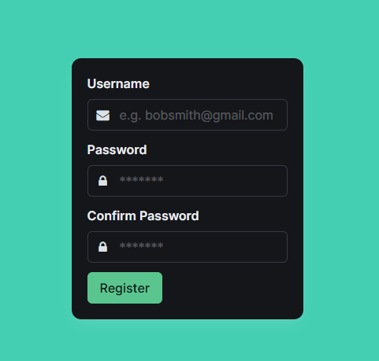
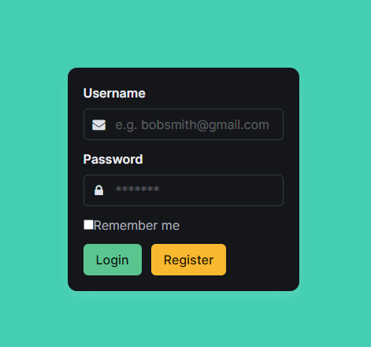
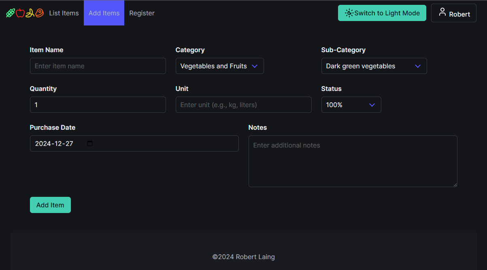
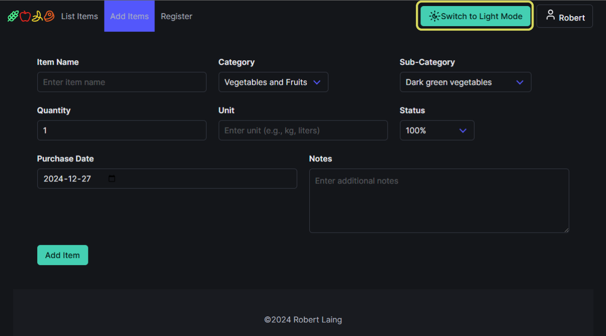
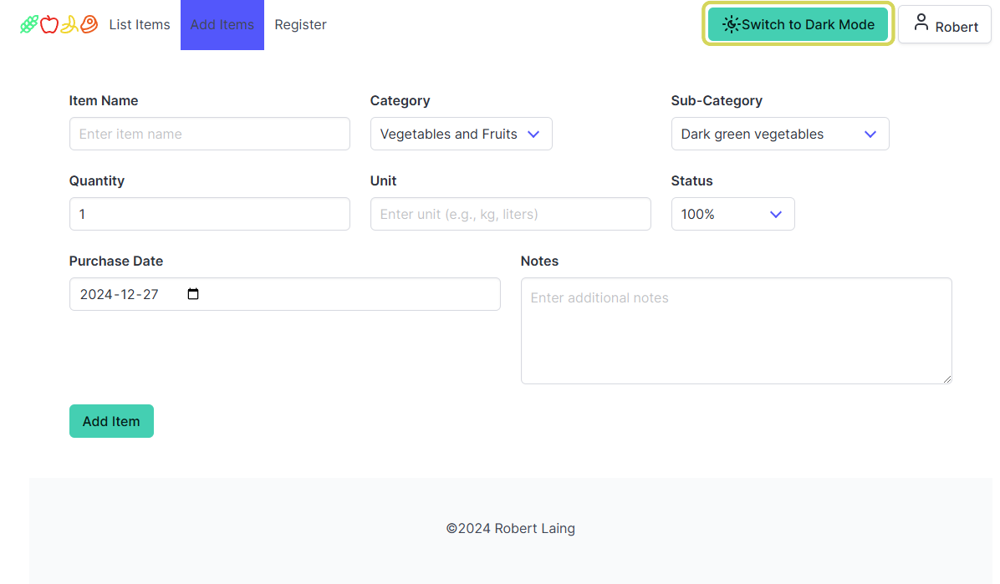
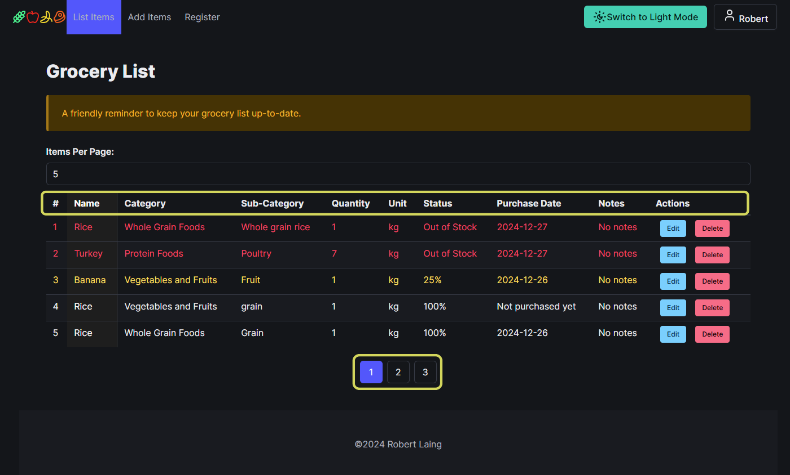
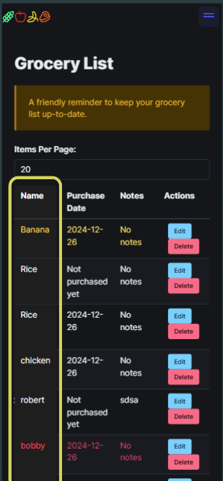

# Final-Project: Grocery List App

The React Grocery List App is a lightweight and simple tool that allows multiple family members to collaborate in tracking and listing items that need regular replenishment.

## Table of Contents

- #### [Features](#features)
- #### [Installation](#installation)
- #### [Usage](#usage)
- #### [License](#license)
- #### [Contact](#contact).

## Features

- **Feature 1:** The register and login pages enable new users to sign up and returning users to log in with ease.

  
  

- **Feature 2:** A clean and intuitive interface makes adding items quick and simple.

  

- **Feature 3:** Users can seamlessly switch between dark mode and light mode for a personalized experience.

  
  

- **Feature 4:** Features pagination and sortable table headers for easy data navigation and organization.

  

- **Feature 5:** Mobile-friendly design with a sticky table column for an improved browsing experience when viewing numerous items.

  

## Installation

The grocery store application consists of two components: the front end and the back end.

**Back End:** Handles user authentication, data storage, and provides CRUD functionalities.  
**Front End:** Delivers the user interface for interacting with the application.

**Installation Steps**

1. Download the required files for both the front-end and back-end components.
2. Update the `.env` file for the front-end component, specifying the API URL and port.
3. Update the `.env` file for the back-end component, ensuring the correct port number is defined.

**Starting the Application**

- **For the back end:** Run `npm run start`
- **For the front end:** Run `npm run dev`

Ensure the API URL and ports are correctly configured for seamless communication between the components.

## Usage

Grocery items are logged into the system as they are purchased, including details such as the item name, category, sub-category, unit, status, purchase date, and notes.

- As items are consumed, their status can be updated (e.g., "Out of Stock," "25%", etc.).
- When it's time to shop, users can sort the table to quickly identify items that are out of stock.
- To improve usability, items with an "Out of Stock" status are highlighted in red, while those at "25%" are highlighted in yellow.
- Items can be edited or deleted as needed to keep the list accurate and up to date.

## License

GNU GENERAL PUBLIC LICENSE  
Version 3, 29 June 2007

Copyright (C) 2024 Robert Laing

This program is free software: you can redistribute it and/or modify it under the terms of the GNU General Public License as published by the Free Software Foundation, either version 3 of the License, or (at your option) any later version.

This program is distributed in the hope that it will be useful, but WITHOUT ANY WARRANTY; without even the implied warranty of MERCHANTABILITY or FITNESS FOR A PARTICULAR PURPOSE. See the GNU General Public License for more details.

You should have received a copy of the GNU General Public License along with this program. If not, see <https://www.gnu.org/licenses/>.

## Contact

Robert Laing: rlaing0082@gmail.com
